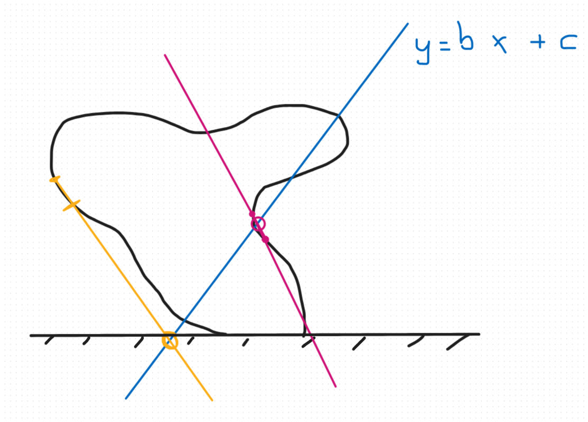
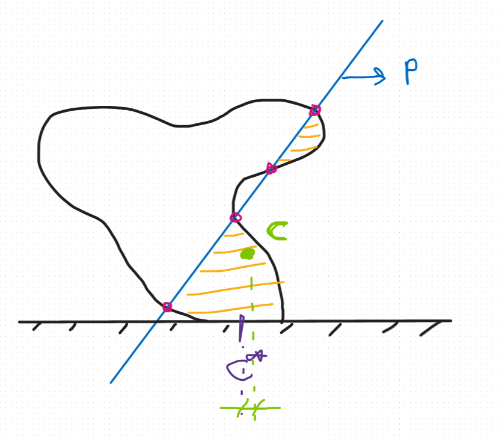
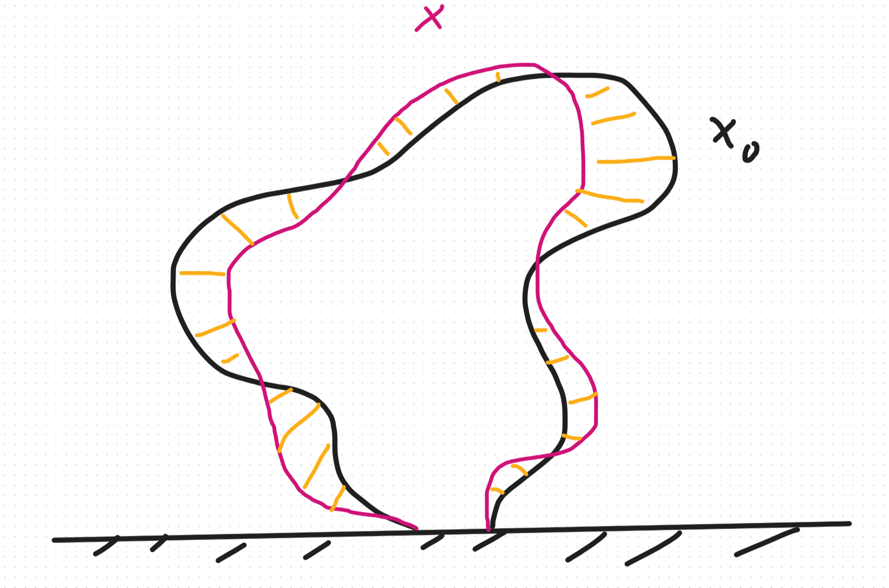

# 1st: What shape 
We define the shape we want to stabilize by 2 objects:
 - The vetrex `V=[[x0, y0],[x1, y1],...,[xn-1, yn-1]]`
 - The edges `E=[[0, 1],[1, 2],...]`


# 2nd: What function to minimize
We need to define a function `f` that if we minimize it we achieved diferent objectives. These are:
 1. Stabilization thanks to carving (aka moving the center of mass)
 2. Smoothing the surface
 3. Similarity to the initial surface

Let's get to it.

## Stabilization thanks to carving
This one is the most complicated. But before... what is stabilizing? Stabilizing means moving the center of mass of our shape so that its projection lies within the stable zone \[add better definition\]. How can we do it? By going from a completely solid shape to one that isn’t fully solid, that is, we’ve carved the inner surface/volume. Check \[_Spin-It Faster: Quadrics Solve All Topology Optimization Problems That Depend Only On Mass Moments_ from Hanfer et all\] to make sure it’s enough to consider just a line that produces that carving.

As we see in the first image, we have the shape we want to stabilize and a blue line given by its equation, aka two variables, `y=bx+c` that divide the surface in a completely rigid zone and an empty one. How do we compute it? How do we find the different intersections? The idea can be seen in the image, but I’ll explain it to you:

> For each edge, we construct the equation of the line that contains it.
> 
> find the intersection with the blue equation.
> 
> If that intersection is not on the edge or doesn’t exist, (*yellow case*)
> 
> then it’s not the one we’re looking for.
> 
> If that intersection is on the edge or there are infinite intersections, (*purple case*)
> 
> then we save that intersection in a list.
> 
> By the end, we have the full list of intersections.



Once we have the intersections, we need to define which side is filled and which is not. And I don't know which one (Samara help hahaha). 




## Smoothing the surface
As you can see in the drawing, the idea of smoothing the surface is to take every three consecutive vertices (the orange or yellow ones) `v_0, v_1 ,v_2`, compute the midpoint of `v_0` and `v_2` (the blue point `v_{02}`), and calculate its distance to point `v_1` (the purple segment). By minimizing this distance for each triplets, we eliminate isolated spikes from the surface.


And the function is this one, adding up all the consecutive triplets

$$f_2(V)=\sum_{v0,v1,v2\in V} \frac{1}{2}\left\|\left\|v_1-\frac{1}{2}\left(v_0+v_2\right)\right\|\right\|^2$$

A kind off pseudocode for this will be:

```python
def f2(V,E):
 inicialice f2=0
 for each vertex in V:
  define it as v0
  obtain the edge where v0 is the first one
  obtain the next vertex v1
  if v1[1]==0 and v0[1]==0:
   then ignore this triplet bc is in the support plane
  else:
   obtain the edge where v1 is the first one
   obtain the next vertex v2
   if v2[1]==0 and v1[1]==0:
    then ignore this triplet bc is in the support plane
   else:
    define the point v02
    calculate the distance between v1 and v02
    f2 += 1/2 of that distance squared
 return f2
```


## Similarity to the initial surface
The drawing makes it clear. We want the shape we're modifying, `x=V'`, to resemble the original shape, `x_0=V`. To do that, since both have the same number of points in the same order, we calculate the distance between each pair of corresponding points (shown in orange) to minimize it. This way, we ensure that our algorithm doesn’t produce a shape that’s different from the original.



And the function is this one, With `V'` being the shape we want to compare with the original `V`.

$$f_3(V')= \frac{1}{2}\left\|\left\|V'-V\right\|\right\|^2$$

A kind off pseudocode for this will be:

```python
def f3(V,E,V_og):
 calculate the difference D=V-V_og
 compute the norm np.linalg.norm(D, ord=2)
 f3 = 1/2 of the norm
 return f3
```
