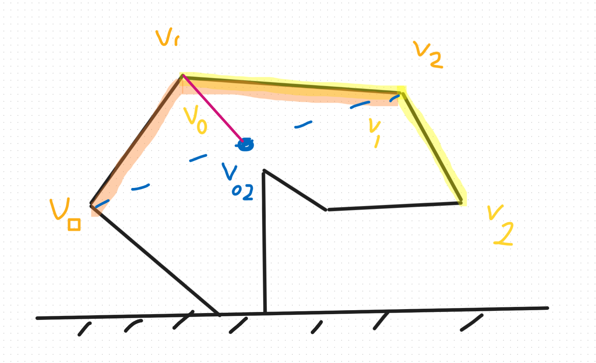

# 1st: What shape 
We define the shape we want to stabilize by 2 objects:
 - The vetrex `V=[[x0, y0],[x1, y1],...,[xn-1, yn-1]]`
 - The edges `E=[[0, 1],[1, 2],...]`


# 2nd: What function to minimize
We need to define a function `f` that if we minimize it we achieved diferent objectives. These are:
 1. Stabilization thanks to carving (aka moving the center of mass)
 2. Smoothing the surface
 3. Similarity to the initial surface

Let's get to it.

## Stabilization thanks to carving


## Smoothing the surface
As you can see in the drawing, the idea of smoothing the surface is to take every three consecutive vertices (the orange or yellow ones) `v_0, v_1 ,v_2`, compute the midpoint of `v_0` and `v_2` (the blue point `v_{02}`), and calculate its distance to point `v_1` (the purple segment). By minimizing this distance for each triplets, we eliminate isolated spikes from the surface.

And the function is this one, adding up all the consecutive triplets
$$f_2(V)=\sum_{v0,v1,v2\in V} \frac{1}{2}\left\|\left\|v_1-\frac{1}{2}\left(v_0+v_2\right)\right\|\right\|^2$$
A kind off pseudocode for this will be:
```python
def f2(V,E):
 inicialice f2=0
 for each vertex in V:
  define it as v0
  obtain the edge where v0 is the first one
  obtain the next vertex v1
  if v1[1]==0 and v0[1]==0:
   then ignore this triplet bc is in the support plane
  else:
   obtain the edge where v1 is the first one
   obtain the next vertex v2
   if v2[1]==0 and v1[1]==0:
    then ignore this triplet bc is in the support plane
   else:
    define the point v02
    calculate the distance between v1 and v02
    f2 += 1/2 of that distance squared
return f2

```


## Similarity to the initial surface


```python
>>> x = x / np.linalg.norm(x)
```
