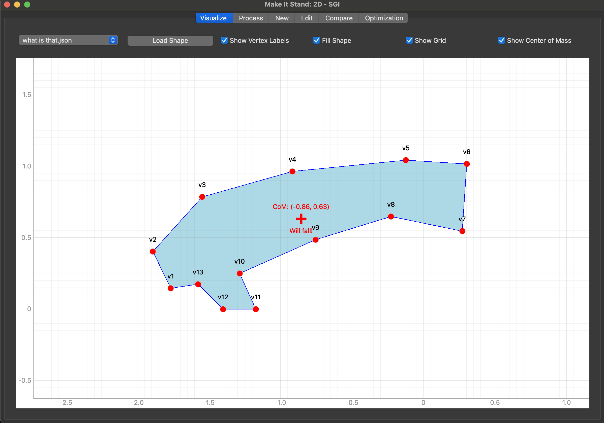
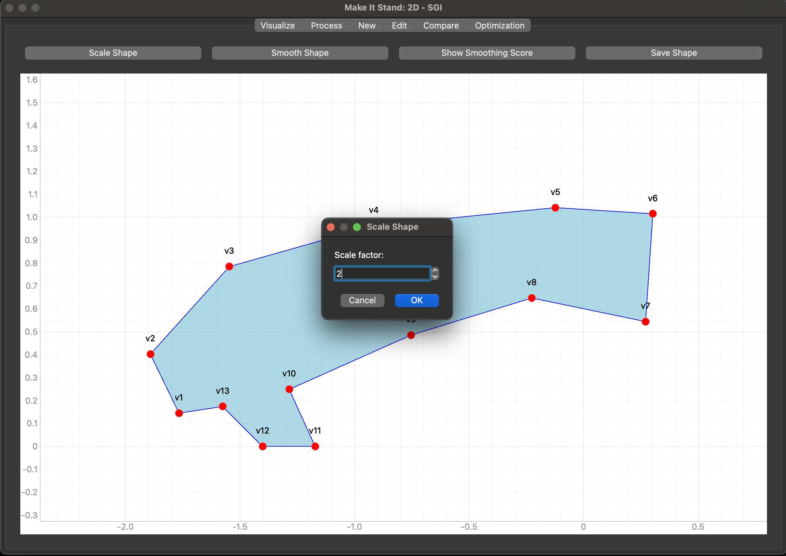
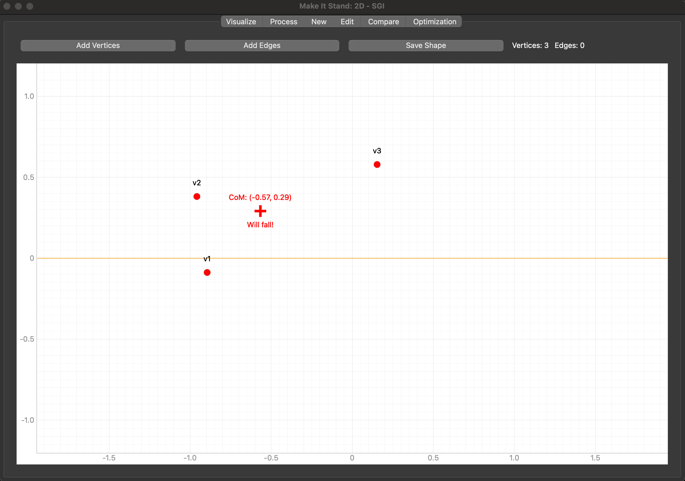
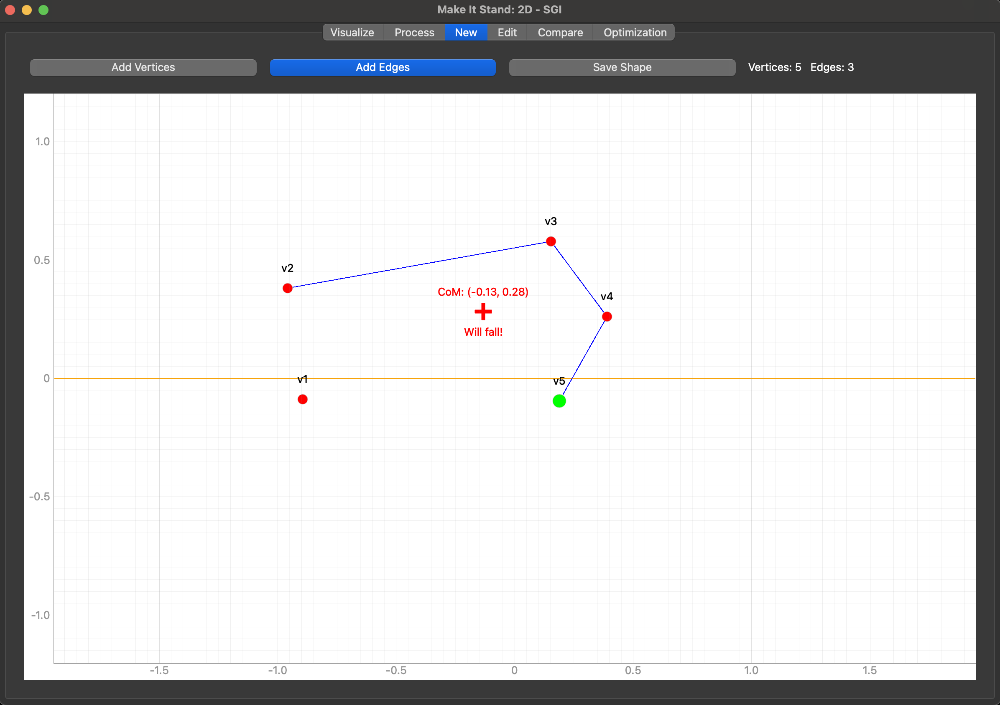
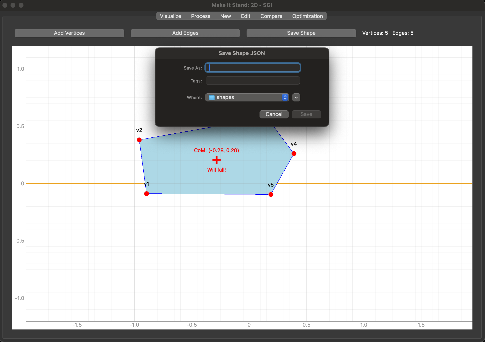
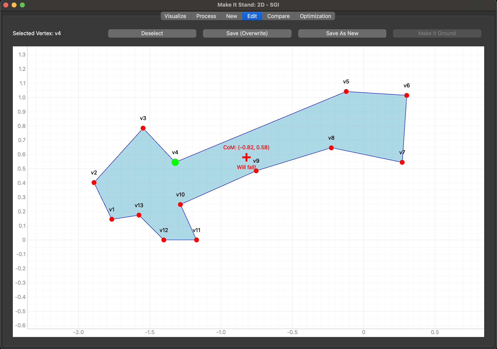
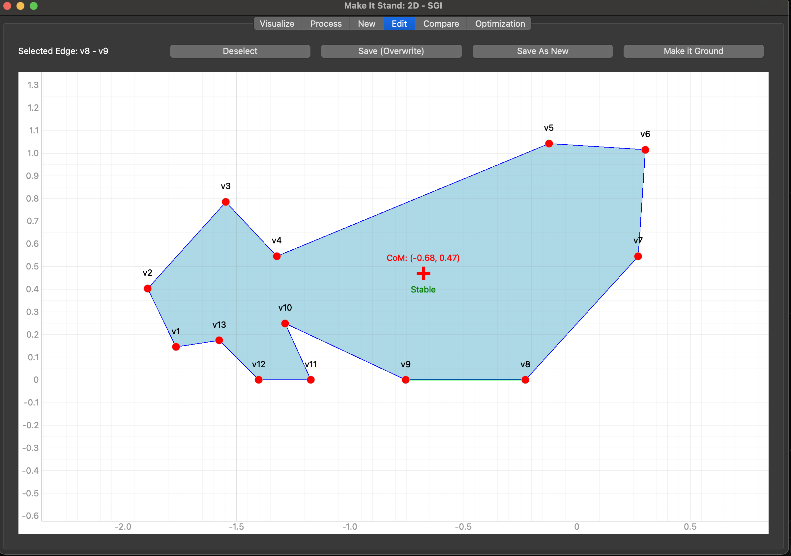
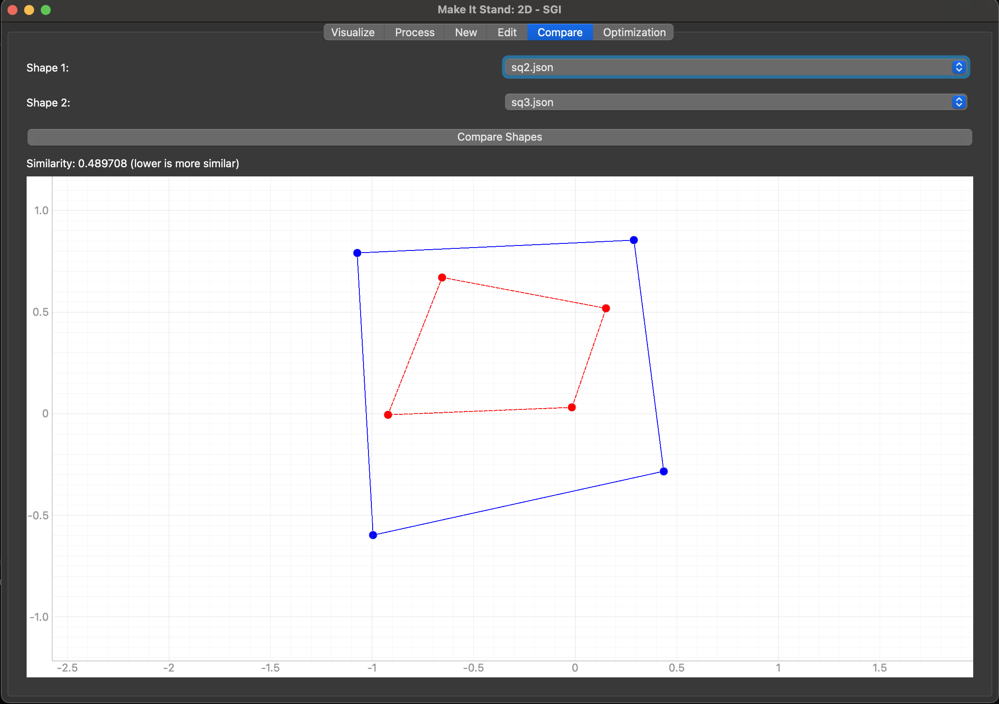
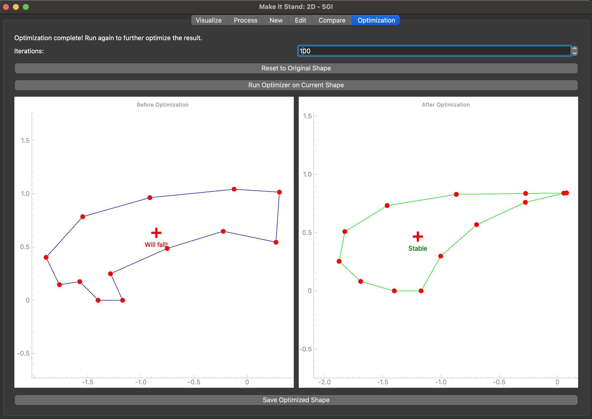

# Make It Stand: 2D - SGI Tutorial

Welcome to the **Make It Stand: 2D - SGI** application! This tutorial will guide you through all the features and tabs of the app, helping you get the most out of your shape design and analysis workflow.

---

## Table of Contents
1. [Introduction](#introduction)
2. [Getting Started](#getting-started)
3. [Tab-by-Tab Guide](#tab-by-tab-guide)
    - [Visualize Tab](#visualize-tab)
    - [Process Tab](#process-tab)
    - [New Tab](#new-tab)
    - [Edit Tab](#edit-tab)
    - [Compare Tab](#compare-tab)
    - [Optimization Tab](#optimization-tab)
4. [Saving and Loading Shapes](#saving-and-loading-shapes)
5. [Tips & Troubleshooting](#tips--troubleshooting)

---

## Introduction

**Make It Stand: 2D - SGI** is a graphical tool for creating, editing, analyzing, and optimizing 2D shapes. It is designed for research and educational purposes, allowing users to experiment with shape stability, mass center, and more.

---

## Getting Started

1. **Install dependencies** (if not already):
   ```bash
   pip install -r src/requirements.txt
   ```
2. **Run the application:**
   ```bash
   python src/main.py
   ```
3. The main window will open, presenting several tabs for different functionalities.

---

## Tab-by-Tab Guide

### Visualize Tab

**Purpose:**
- View and inspect existing shapes.
- See vertices, edges, center of mass, and stability status.
- Toggle grid, labels, and filled shape display.

**How to Use:**
1. Select a shape from the dropdown menu.
2. Use checkboxes to toggle grid, labels, center of mass, and fill options.
3. The plot updates automatically.


---

### Process Tab

**Purpose:**
- Apply processing operations to shapes (e.g., smoothing, scaling, etc.).
- Visualize the effect of processing steps.

**How to Use:**
1. Select a shape to process.
2. Choose the desired processing operation.
3. Adjust parameters if available.
4. View the processed shape in the plot.



---

### New Tab

**Purpose:**
- Create a new shape from scratch by adding vertices and edges.

**How to Use:**
1. Click **Draw Mode** to start adding vertices (click on the plot to place them).
2. Switch to **Add Edge Mode** to connect vertices by clicking near them in sequence of pairs.
3. Use the info panel to see current vertices and edges.
4. Choose the name and save your new shape when done.


Adding vertices.


Connecting edges.


Saving result.


---

### Edit Tab

**Purpose:**
- Edit existing shapes by moving vertices or modifying edges.
- Select and drag vertices, or select edges for editing.
- Define an edge as the ground: make the vertex pair go yo Y-0

**How to Use:**
1. Select a shape to edit.
2. Click on a vertex to select and drag it to a new position.
3. Click on an edge to select it for make it the ground.
4. Save changes when finished.


Selecting and moving vertices.


Editing edges.

---

### Compare Tab

**Purpose:**
- Compare two shapes side by side.
- Analyze differences in structure, mass center, or other properties.

**How to Use:**
1. Select two shapes from the dropdowns.
2. View both shapes plotted for comparison.
3. Use any available metrics or visual aids to analyze differences.



---

### Optimization Tab

**Purpose:**
- Optimize a shape for stability or other criteria.
- Visualize the optimization process and results.

**How to Use:**
1. Select a shape to optimize.
2. Choose optimization parameters if available.
3. Run the optimization and observe the updated shape and metrics.



---

## Saving and Loading Shapes

- **To load a shape:** Use the file dialog in the Visualize or Edit tab, or select from the dropdown.
- **To save a shape:** Use the save button in the New or Edit tab. You can overwrite an existing file or create a new one.
- Shapes are stored as JSON files in the `shapes/` directory by default.

---

## Tips & Troubleshooting

- **Snap to y=0:** When drawing, vertices close to the y=0 axis will snap to it for easier alignment.
- **Stability Indicator:** The center of mass and stability status are shown on the plot.
- **Undo/Redo:** (If available) Use undo/redo buttons to revert changes.
- **Saving:** Always save your work before switching tabs to avoid losing changes.
- **Common Issues:**
    - If shapes do not appear, ensure they are valid and have at least 3 vertices and edges.
    - If the app crashes, check the terminal for error messages and ensure all dependencies are installed.

---

Happy designing and analyzing shapes! 